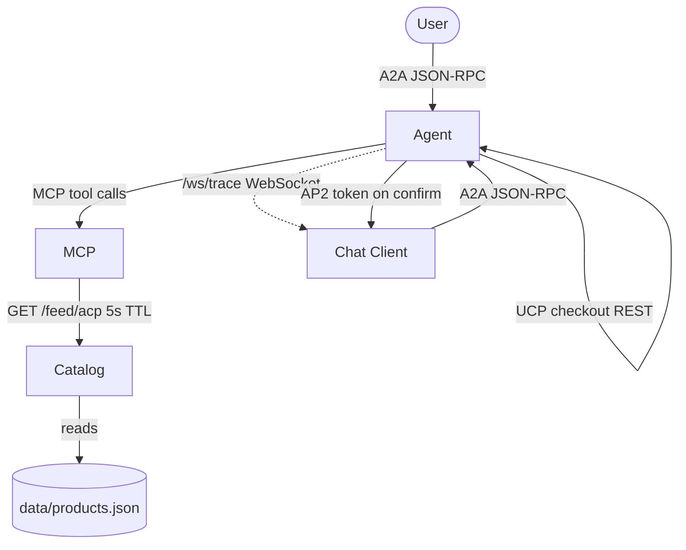
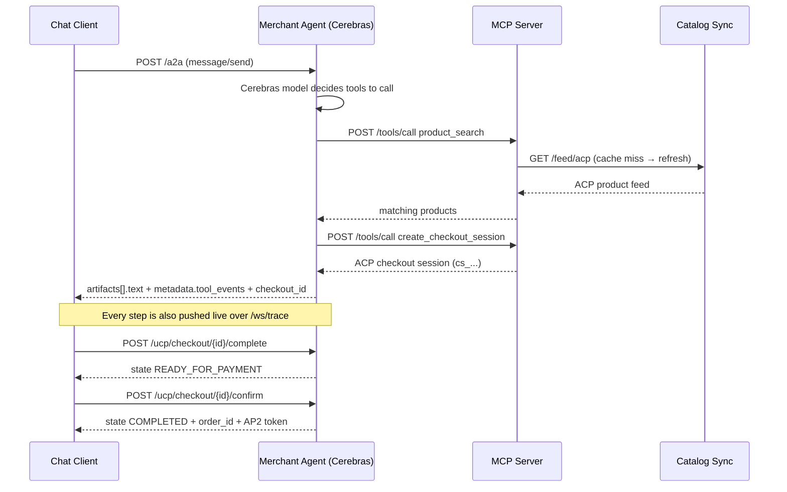

# Architecture

This stack models a real merchant's agentic-commerce surface as four small services. Each one owns a single concern and talks to the others over HTTP, so you can read, run, and break them independently.

## Services

| Service | Port | Stack | Responsibility |
|---|---|---|---|
| `demo/catalog-sync` | 8002 | FastAPI + APScheduler | Pretends to be the merchant's PIM/ERP. Reads `data/products.json` and republishes it as three competing feed formats (ACP, UCP, Meta) on a 60s schedule. |
| `demo/mcp-server` | 8001 | FastAPI | Exposes the catalog and checkout as **MCP tools**. Has **no hardcoded catalog** — it pulls the live ACP feed from catalog-sync with a 5-second TTL cache. |
| `demo/merchant-agent` | 10999 | FastAPI + OpenAI SDK | The **Cerebras agent** (OpenAI-compatible API). Speaks A2A (JSON-RPC) to clients, calls MCP tools, drives the UCP checkout lifecycle, issues AP2 tokens, and broadcasts a live event trace over a WebSocket. |
| `demo/chat-client` | 3000 | React 18 + TypeScript | Chat UI plus a 6-tab Protocol Inspector (A2A, MCP, UCP, ACP, Payment, ⚡ Timeline). |

### Environment variables

| Variable | Used by | Local value | Docker default |
|---|---|---|---|
| `CEREBRAS_API_KEY` | merchant-agent, evals/quality | Cerebras API key | — |
| `CEREBRAS_MODEL` | merchant-agent, evals/quality | `gpt-oss-120b` | `gpt-oss-120b` |
| `CATALOG_SYNC_URL` | mcp-server | `http://localhost:8002` | `http://catalog-sync:8002` |
| `MCP_SERVER_URL` | merchant-agent, mcp-server | `http://localhost:8001` | `http://mcp-server:8001` |
| `AGENT_BASE_URL` | merchant-agent | `http://localhost:10999` | `http://merchant-agent:10999` |
| `REACT_APP_AGENT_URL` | chat-client (build-time) | `http://localhost:10999` | baked at build |

> The defaults are **Docker service hostnames**. When running outside Docker (e.g. via `scripts/app-start.sh`), every consumer must be pointed at `localhost`. This is exactly why a service that forgets to set `CATALOG_SYNC_URL` ends up with an empty catalog locally.

## How the services connect



## Lifecycle of one chat turn

A single user message — "add Kitten Mittons Shortbread to cart and check out" — touches every protocol in the stack:



### A2A response shape

The chat client and the eval suites both depend on this exact structure returned from `POST /a2a`:

```jsonc
{
  "jsonrpc": "2.0",
  "id": "<request id>",
  "result": {
    "status": { "state": "completed" },
    "artifacts": [{ "parts": [{ "kind": "text", "text": "<agent reply>" }] }],
    "metadata": {
      "tool_events": [{ "tool": "product_search", "...": "..." }],
      "checkout_id": "cs_6fa3e2da7fda",
      "ucp_checkout": { "state": "NOT_READY_FOR_PAYMENT", "...": "..." }
    }
  }
}
```

> When the agent's LLM call fails (e.g. a Cerebras rate limit), the agent returns HTTP 200 with a JSON-RPC **`error`** object instead of `result`. Clients and evals must check for `error` — an empty `result` is the symptom, not the cause. See [evals.md](evals.md#rate-limits).

## The live-catalog design

The MCP server deliberately holds **no products of its own**. On each tool call it checks a 5-second cache; on a miss it fetches `GET {CATALOG_SYNC_URL}/feed/acp` (and `/feed/discounts`). This is what makes the "edit a price → trigger sync → tool reflects it" demo work end to end:

```bash
$EDITOR demo/catalog-sync/data/products.json
curl -X POST http://localhost:8002/sync/trigger
curl -X POST http://localhost:8001/tools/call \
  -H 'Content-Type: application/json' \
  -d '{"name":"product_search","input":{"query":"shortbread"}}'
```

The trade-off: the MCP server is useless without catalog-sync running. The launcher (`scripts/app-start.sh`) therefore starts catalog-sync **first** and wires `CATALOG_SYNC_URL` into the MCP server.

## Running it

- **Docker (recommended):** `docker-compose up --build` — service discovery uses the compose hostnames.
- **No Docker:** `./scripts/app-start.sh` — creates a `.venv`, installs deps (incl. APScheduler + websockets), starts catalog-sync → mcp-server → merchant-agent → React, all pointed at `localhost`.

## The template vs. the demo

`template/` is a slimmed-down fork-me version: the MCP server ships an **inline** sample catalog instead of depending on catalog-sync, so the starter kit is a 3-service stack with fewer moving parts. The demo is the full 4-service reference. See [template/README.md](../template/README.md).
