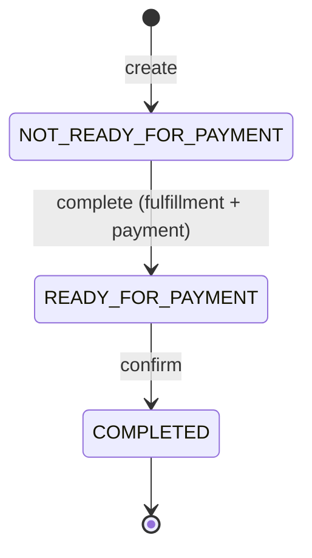

# The Protocol Stack

Agentic commerce isn't one protocol — it's a layered set, each solving a different problem. This stack implements five, and this doc maps every one to **what it does**, **who defines it**, and **exactly where it lives in this repo**.

| Layer | Protocol | Question it answers | In this repo |
|---|---|---|---|
| Tools | **MCP** | How does the agent *do* things (search, check stock, start checkout)? | `demo/mcp-server` |
| Agent I/O | **A2A** | How does a client talk *to* the agent? | `demo/merchant-agent` → `POST /a2a` |
| Discovery | **ACP** | How does an AI surface *find* the merchant's products? | `demo/catalog-sync` → `/feed/acp` |
| Checkout | **UCP** | How does a buy *complete* across agent boundaries? | `demo/merchant-agent` → `/ucp/checkout/*` |
| Payment | **AP2** | How is *payment authorized* with scoped, revocable consent? | issued on checkout confirm |

---

## MCP — Model Context Protocol

**What:** A standard for exposing typed **tools** to an LLM. The agent gets a list of tool schemas, picks one, sends structured input, and gets structured output.
**Who:** [modelcontextprotocol.io](https://modelcontextprotocol.io)
**Here:** `demo/mcp-server` exposes 12 tools.

```
GET  /tools             → list of tool schemas (name, description, input_schema)
POST /tools/call        → { "name": "...", "input": { ... } } → tool result
GET  /health            → catalog cache status
```

Example:

```bash
curl -X POST http://localhost:8001/tools/call \
  -H 'Content-Type: application/json' \
  -d '{"name":"product_search","input":{"query":"cookie","in_stock":true}}'
```

Tools include `product_search`, `get_product_details`, `inventory_check`, `get_bestsellers`, `get_store_policy`, `apply_discount`, and the ACP checkout lifecycle (`create_checkout_session`, `update_checkout_session`, `get_checkout_session`, `complete_checkout_session`, `cancel_checkout_session`).

---

## A2A — Agent-to-Agent

**What:** A **JSON-RPC 2.0** envelope for sending a message to an agent and receiving a structured task result (text + artifacts + metadata). Agents advertise themselves with an **agent card**.
**Who:** [github.com/a2aproject/A2A](https://github.com/a2aproject/A2A)
**Here:** `demo/merchant-agent`.

```
GET  /.well-known/agent-card.json   → name, description, url, extensions
POST /a2a                           → JSON-RPC message/send
WS   /ws/trace                      → live event stream for the inspector
```

Request:

```json
{
  "jsonrpc": "2.0",
  "id": "1",
  "method": "message/send",
  "params": {
    "contextId": "session-1",
    "message": { "parts": [{ "kind": "text", "text": "what are your bestsellers?" }] }
  }
}
```

The response carries the reply in `result.artifacts[0].parts[0].text`, the tools the agent fired in `result.metadata.tool_events[].tool`, and (on a buy) `result.metadata.checkout_id`. The exact shape is documented in [architecture.md](architecture.md#a2a-response-shape).

> **Error mode:** if the LLM call fails, the agent replies HTTP 200 with a JSON-RPC `error` object (no `result`). Always branch on `error` before reading `result`.

---

## ACP — Agentic Commerce Protocol

**What:** OpenAI's spec for two things: (1) the **product feed** a merchant submits so AI surfaces can index its catalog, and (2) the **checkout session** object used during purchase.
**Who:** [developers.openai.com/commerce](https://developers.openai.com/commerce) · [Products API](https://developers.openai.com/commerce/specs/api/products)
**Here:** the **feed** side is `demo/catalog-sync`; the **checkout session** side is implemented as MCP tools on `demo/mcp-server`.

```
GET /feed/acp      → ACP product feed   (schema "acp/2026-04-17", prices in minor units)
GET /feed/ucp      → UCP product feed   (Google Merchant Center shape)
GET /feed/meta     → Meta catalog feed
GET /feed/discounts
GET /status        → last sync + per-feed record counts
POST /sync/trigger → re-run the ETL now (for live demos)
```

An ACP **checkout session** (`cs_...`) tracks `line_items`, `totals`, and a `status` that walks from `NOT_READY_FOR_PAYMENT` → ready → completed, mirroring the UCP lifecycle below.

---

## UCP — Universal Commerce Protocol

**What:** Google's protocol for completing a checkout that spans agent/merchant boundaries — a REST checkout resource plus a `/.well-known/ucp` capability profile.
**Who:** [developers.google.com/merchant/ucp](https://developers.google.com/merchant/ucp)
**Here:** `demo/merchant-agent`.

```
GET  /.well-known/ucp                    → UCP capability profile
GET  /ucp/checkout/{id}                  → current checkout state
POST /ucp/checkout/{id}/complete         → add fulfillment + payment instrument
POST /ucp/checkout/{id}/confirm          → finalize → order + AP2 token
```

State machine:



`complete` adds the chosen fulfillment option (e.g. `express` → shipping recalculated) and moves to `READY_FOR_PAYMENT`; `confirm` produces an `order_id` and the AP2 token.

---

## AP2 — Agentic Payments Protocol

**What:** A scoped, revocable **payment authorization token** an agent presents instead of raw card data. It encodes *who* consented, *how much* is authorized, and *where* it's valid.
**Who:** [agenticcommerce.dev](https://agenticcommerce.dev)
**Here:** minted by `demo/merchant-agent` on `POST /ucp/checkout/{id}/confirm`.

```jsonc
{
  "token_id": "tok_f5037af79643",
  "sub": "user_demo_001",
  "intent": "purchase:retail:kitten_mittons_shortbread",
  "merchant_scope": "purrfect-bites.demo",   // token only valid for this merchant
  "max_amount": 29.98,                        // hard spend ceiling
  "currency": "USD",
  "single_use": true,                         // cannot be replayed
  "revocation_url": "https://pay.agent/revoke/tok_...",
  "user_consent_proof": "vc:credential:...",  // verifiable consent reference
  "expires_at": "2026-05-05T23:59:59Z",
  "issued_at": 1782011270.04
}
```

The **Payment** tab in the chat client decodes this token field-by-field and explains why each one matters (scope, ceiling, single-use, revocation, consent proof). It's a mock — no real funds move — but the shape mirrors a production agentic-payment credential.

---

## Putting it together

One purchase exercises all five: the client speaks **A2A** to the agent, the agent uses **MCP** tools whose catalog came from an **ACP** feed, checkout completes over **UCP**, and payment is authorized with an **AP2** token. See the end-to-end sequence in [architecture.md](architecture.md#lifecycle-of-one-chat-turn).
